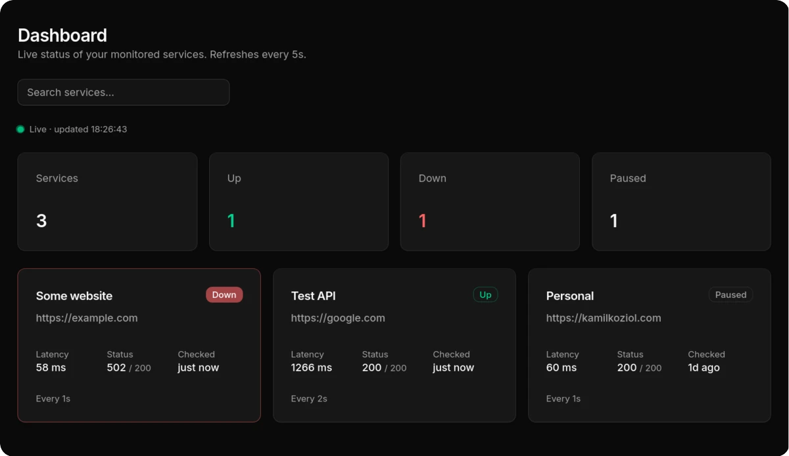

# pingo

A dead-simple, single-binary uptime monitor built in Go. 

Pingo is designed for developers who want a lightweight, self-hosted alternative to heavy monitoring platforms. It reads a simple YAML file, pings your websites and APIs, stores the results in a local SQLite database, and alerts you via email or webhook if anything goes offline.

A clean, minimal web dashboard gives you a simple overview of your services, uptime, response times, and recent incidents—without the noise of a full monitoring platform.

<p align="center">
  <a href=".github/dashboard.webp">
    
  </a>
</p>


## Quick start

There is just a single binary that you can run `pingo`

### Using docker

Mount your configuration file into the container and run the image:

```sh
docker run --rm \
  -v "$(pwd)/config.yml:/config.yml:ro" \
  ghcr.io/kamil-koziol/pingo:latest
```


## Configuration

The application is configured using a `config.yml` file.

### Health Checks

Define the services you want to monitor under the `checks` section.

Each check supports:

- `name` — A human-readable name for the service.
- `url` — The endpoint to check.
- `interval` — How often the check should run.
- `expected_status` — The expected HTTP response status code. Default: 200

Example:

```yaml
checks:
  - name: "Auth API"
    url: "https://example.com"
    interval: 60s
    expected_status: 200

  - name: "Google"
    url: "https://google.com"
    interval: 30s
    expected_status: 200
```

### Alerts

The application supports multiple alerting backends.

#### Telegram

To enable Telegram notifications, provide your bot token and chat ID.

Example:

```yaml
alerts:
  - name: "Your telegram bot"
    type: "telegram"
    config:
      bot_token: "your_bot_token"
      chat_id: "your_chat_id"
```

**Creating a Telegram Bot**

1. Create a new bot using [BotFather](https://telegram.me/BotFather)
2. Obtain the chat ID: `https://api.telegram.org/bot<bot_token>/getUpdates`

### API

- **Protocol Buffer Definitions (`.proto`):** Located under [`/proto`](./proto) for gRPC client generation and schema references.

> **Note:** The HTTP JSON gateway proxies requests to the internal gRPC server. Therefore, **HTTP cannot be enabled if gRPC is disabled**.

Example:

```yaml
api:
  grpc:
    enabled: false
    port: 50051
    reflection: false # see https://grpc.io/docs/guides/reflection/

  http:
    enabled: false
    port: 8080
```

### Web UI Dashboard

Set `web.enabled` to `true` to serve the built-in web dashboard, which shows the live status of your services, on the port given by `web.port` (default `3000`).

Example:

```yaml
web:
    enabled: false
    port: 3000
```
